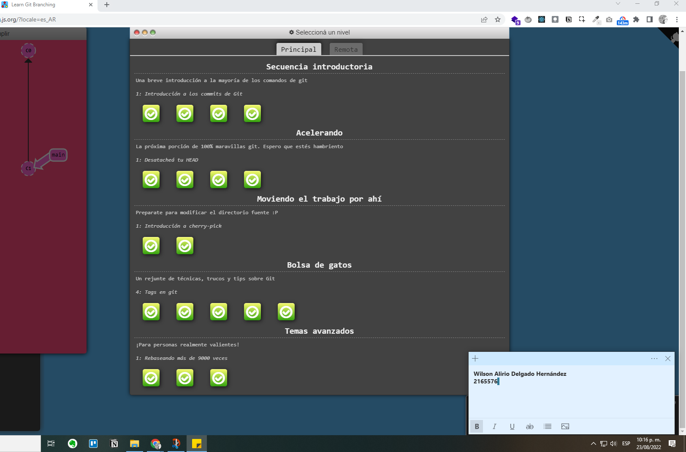
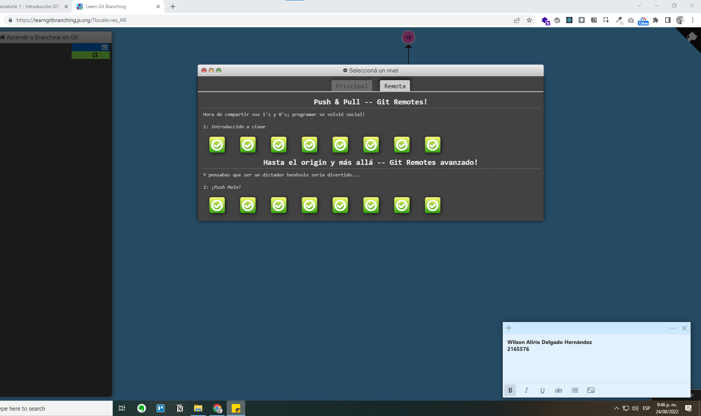

# Datos Personales

## General
* **Nombre**: _Wilson Alirio Delgado Hernández_
* **Edad**: 20

## Foto


#### Hello, World! 

Python

```
print("Hello, World!")
```

JavaScript

```
console.log("Hello, World!")
```


### Estudios
Ingeniería de Sistemas | 2019-2023
[Información sobre pregrado](https://www.escuelaing.edu.co/es/programas/ingenieria-de-sistemas/)

> Me apasiona el desarrollo de software y la ciencia de datos. Estoy interesado en participar en proyectos que me permitan desempeñar como desarrollador Backend.

[LinkedIn](https://www.linkedin.com/in/wilson-delgado/)

### Idiomas
1. Español
2. Inglés
3. Portugués


# Learning git branching

## Main



## Remote



